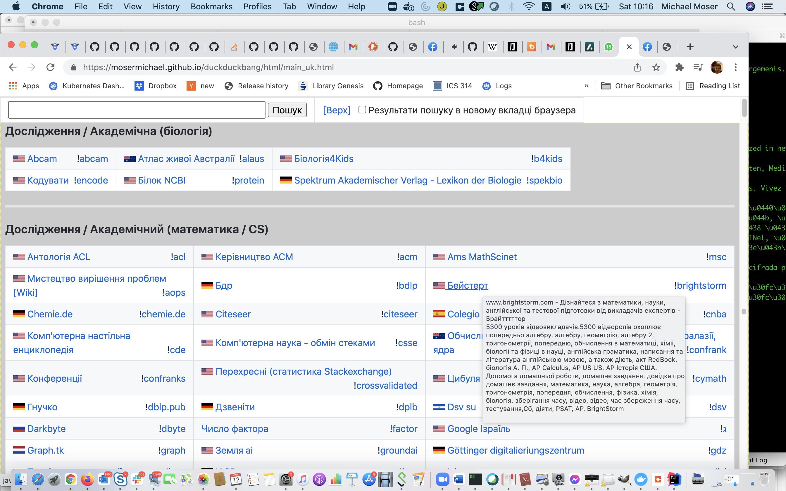

# Meta search tool builder

This script builds the html pages for a little meta-search tool; The tool attempts to be a is a slightly better organized directory of the duckduckgo [bang!](https://duckduckgo.com/bang) search commands.

There are quite a few versions of the page, all generated dynamically, you can view the results here:

|                              | Desktop version | mobile version  |
|------------------------------|:---------------:|:---------------:|
|Using the Original text       | [link](https://mosermichael.github.io/duckduckbang/html/main.html)                | [link](https://mosermichael.github.io/duckduckbang/html/main_mobile.html)                | 
|Auto translation to Chinese   | [link](https://mosermichael.github.io/duckduckbang/html/main_zh.html)                | [link](https://mosermichael.github.io/duckduckbang/html/main_mobile_zh.html)                |
|Auto translation to English   | [link](https://mosermichael.github.io/duckduckbang/html/main_en.html)                | [link](https://mosermichael.github.io/duckduckbang/html/main_mobile_en.html)                |
|Auto translation to French    | [link](https://mosermichael.github.io/duckduckbang/html/main_fr.html)                | [link](https://mosermichael.github.io/duckduckbang/html/main_mobile_fr.html)                |
|Auto translation to German    | [link](https://mosermichael.github.io/duckduckbang/html/main_de.html)                | [link](https://mosermichael.github.io/duckduckbang/html/main_mobile_gr.html)                |
|Auto translation to Russian   | [link](https://mosermichael.github.io/duckduckbang/html/main_ru.html)                | [link](https://mosermichael.github.io/duckduckbang/html/main_mobile_ru.html)                |
|Auto translation to Spanish   | [link](https://mosermichael.github.io/duckduckbang/html/main_es.html)                | [link](https://mosermichael.github.io/duckduckbang/html/main_mobile_es.html)                |
|Auto translation to Ukrainian | [link](https://mosermichael.github.io/duckduckbang/html/main_uk.html)                | [link](https://mosermichael.github.io/duckduckbang/html/main_mobile_uk.html)                |
|Auto translation to Japanese  | [link](https://mosermichael.github.io/duckduckbang/html/main_ja.html)                | [link](https://mosermichael.github.io/duckduckbang/html/main_mobile_ja.html)                |

You can select a duckduckgo  bang! search operator, the operator then appears in the seach input box, where you can add your query; A search query that includes the selected bang! operator is sent to https://duckduckgo - once you press enter press or the Go! button; duckducko then redirects the query to a search engine specified by the operator.

A web search on duckduckgo that includes a bang! search command is redirected to a specialized search engine (the most famous bang operator is g! - a web search is redirected to google search if the term g! is added to the query text); now duckduckgo maintains a directory of these bang! search commands, each of these commands stands for a different search engine that takes over the web search.

Here is a screenshot of the translation into Ukrainian in action: (of course automatic translation isn't without problems, but it is better than nothing...) 

The meta-search tool has the advantage of having all duckduckgo bang! search commands in one page, it uses the same catalog of operators as duckduckgo. I think having all bang! operators on one page makes it easier to use the feature.

The page is kept up to date by a nightly build process (runs courtesy of [github workflows/actions](https://docs.github.com/en/free-pro-team@latest/actions/learn-github-actions) ) Any new bang! operator should therefore appear in the search tool.

Update: This tool also made it to the Hacker News front page! [link](https://news.ycombinator.com/item?id=24618447); I really learned quite a bit from the comments section. Thanks for the feedback. Thanks!

# Motivation for the search tool 

Lately I have been increasingly using specialised search engines; for example when searching for code examples it is possible to find quite a lot with [github search](https://github.com/search/advanced) (the search operators are explained [here](https://docs.github.com/en/free-pro-team@latest/github/searching-for-information-on-github/searching-code) and [here](https://docs.github.com/en/github/searching-for-information-on-github/understanding-the-search-syntax). I have not been able to get the same quality results in any of the big search engines.

Now general purpose search engines like [google](https://google.com), [bing](https://bing.com) and [yandex](https://yandex.com/) have a hard time to give reasonable answers to each and every search request. Google has a hard job: it has identify the intent of your query and give you the stuff that is relevant to your query, and then sort the results by the internal score of 'ranking'. These results have to be good for a very wide range of individuals.

Specialized search engines have it much easier - they don't have to work hard to determine the intent of the query, as they are focused on a particular domain.  Also they may have a more focused and sometimes deeper index on a particular domain; You might consider using a specialized search engine if you fail to find the stuff with google or bing. With duckduckgo you get this huge classification with the bang! search operator (that's where this project comes in). 

These specialized search engines will also tend to respect your privacy, more than the big players do; specialized search engines might not have the resources to do much snooping anyway (this might not always be the case, depending on affiliation, etc. etc.)

# Script that builds the page

Projects like this usually end up with a number of processing steps, and it's better to document these steps and the intermedeate files properly (learned that the hard way)

## Processing stages

- Command: ./build_cats.py --html
- Purpose: build the English language html page
- Input files:
    -	Flag_list.txt :: flag file names
    -	main.template search.template :: templates for html files of desktop version
    -	main_mobile.template, search_mobile.template :: templates for html files of mobile version
    -	description_cache.json :: (if present) use the description of each search engine host for tool tips
- Output files:
    -	description_cache.json :: initial version of the file is created upon first run)
    -	ui_text_string.txt :: each line is a string that appears as a label in the page
- Process:
    1. It loads the following url [https://duckduckgo.com/bang.js](https://duckduckgo.com/bang.js) this gives a json file that contains an entry for each bang! search operator, and the classification of the operator in the official [bang page](https://duckduckgo.com/bang).
    2. Builds the category/subcategory breakup that is used to display the [bang page](https://duckduckgo.com/bang).  
    3. Formats an html page that contains all of the !bang operators into one page (maintain categories displayed in the official bang page)
- Note:
    - a special run is required, after we finished with downloading the descriptions in description_cache.json files (see ./build_cats --cache)

----

- Command: ./build_cats.py --cache --timeout  TIMEOUT_SEC
- Input file: description_cache.json
- Output file: description_cache.json
- Purpose: fetches the html page of each host, derives the description from meta tag and title tags that appear in the html of the page. (direct download of the page with python http.client library)
- Output file:
    -	description_cache.json :: sets the following fields; description, description_error, http_document_language, html_document_language

- Command: ./build_cats.py –cache –selenium –no-http-client  –timeout  TIMEOUT_SEC
- Purpose: like previous command, just uses the firefox browser via selenium package.
    - Some hosts can’t be scanned by regular scanner (example: cloudlflare and other DDOS protection mechanisms involve several http redirects, where javascript code is run to determine the next step; therefore get html by automating the browser)

----

- Command: ./build_geoip.py
- Input file: description_cache.json
- Output file: description_cache.json
- Purpose: set geoip_lan attribute based on geo-ip lookup of host name

----

- Command: ./build_lang.py
- Input file: ui_text_string.txt
- Output file: description_cache.json
- Purpose: detects the language of the description, and sets the language_description attribute (needed for automatic translation, but maybe i would be better off with auto...)

----

- Command: ./build_translate.py --descr
- Input file: description_cache.json
- Output file: description_cache.json
- Purpose: build auto translation of description into supported set of languages (build translations field in each host entry)

----

- Command: ./build_translate.py --uitext
- Input file: ui_text_string.txt
- Output file: ui_text_translated.json
- Purpose: build auto translation of each user interface string that appears on the page (not site descriptions)

-----

- Command: ./build_cats.py ––translate
- Input files: 
    -	description_cache.json  :: description of hosts (after translation)
    -	ui_text_translated.json :: strings that appear in the page (after translation)
    -	Flag_list.txt :: flag file names
    -	main.template search.template :: templates for html files of desktop version
    -	main_mobile.template, search_mobile.template :: templates for html files of mobile version
- Purpose: builds translated version of html files, based on auto translation of site descriptions and user interface strings.

## data format

### entry in description_cache.json

Each record represents obtained information on one host

<pre>
  "www.01net.com": {
    "description": "01net - Actualit\u00e9 tech, tests produits, astuces & t\u00e9l\u00e9chargements\nActualit\u00e9s, tests produits, astuces, reportages et t\u00e9l\u00e9chargements. Vivez l'actualit\u00e9 tech d\u00e9crypt\u00e9e par les journalistes de 01net, m\u00e9dia sp\u00e9cialis\u00e9 dans les nouvelles technologies.",
    "description_error": null,
    "description_error_selenium": "",
    "language_description": "__label__fr",
    "http_content_language": null,
    "html_document_language": "fr",
    "translations": {
      "en": "01net - Tech News, Product Tests, Tips & Downloads\nNews, Product Tests, Tips, Reports and Downloads.Live tech news decrypted by 01net journalists, media specialized in new technologies.",
      "de": "01NET - Tech News, Produkttests, Tipps & Downloads\nNachrichten, Produkttests, Tipps, Berichte und Downloads.Live-Tech-News entschl\u00fcsselt von 01NET-Journalisten, Medien, die auf neue Technologien spezialisiert sind.",
      "fr": "01net - Actualit\u00e9 tech, tests produits, astuces & t\u00e9l\u00e9chargements\nActualit\u00e9s, tests produits, astuces, reportages et t\u00e9l\u00e9chargements. Vivez l'actualit\u00e9 tech d\u00e9crypt\u00e9e par les journalistes de 01net, m\u00e9dia sp\u00e9cialis\u00e9 dans les nouvelles technologies.",
      "ru": "01Net - Tech News, \u0422\u0435\u0441\u0442\u044b \u043f\u0440\u043e\u0434\u0443\u043a\u0442\u0430, \u0421\u043e\u0432\u0435\u0442\u044b \u0438 \u0437\u0430\u0433\u0440\u0443\u0437\u043a\u0438\n\u041d\u043e\u0432\u043e\u0441\u0442\u0438, \u0442\u0435\u0441\u0442\u044b \u043f\u0440\u043e\u0434\u0443\u043a\u0442\u0430, \u0441\u043e\u0432\u0435\u0442\u044b, \u043e\u0442\u0447\u0435\u0442\u044b \u0438 \u0437\u0430\u0433\u0440\u0443\u0437\u043a\u0438.\u0416\u0438\u0432\u044b\u0435 \u0442\u0435\u0445\u043d\u043e\u043b\u043e\u0433\u0438\u0438 \u043d\u043e\u0432\u043e\u0441\u0442\u0438 \u0434\u0435\u0448\u0438\u0444\u0440\u043e\u0432\u0430\u043d\u044b \u0436\u0443\u0440\u043d\u0430\u043b\u0438\u0441\u0442\u0430\u043c\u0438 01Net, \u0421\u041c\u0418 \u0441\u043f\u0435\u0446\u0438\u0430\u043b\u0438\u0437\u0438\u0440\u0443\u044e\u0442\u0441\u044f \u0432 \u043d\u043e\u0432\u044b\u0445 \u0442\u0435\u0445\u043d\u043e\u043b\u043e\u0433\u0438\u044f\u0445.",
      "es": "01net - Noticias de tecnolog\u00eda, pruebas de productos, consejos y descargas\nNoticias, pruebas de productos, consejos, informes y descargas.Live Tech News descifrada por periodistas de 01net, medios especializados en nuevas tecnolog\u00edas.",
      "ja": "01 Net  - \u6280\u8853\u30cb\u30e5\u30fc\u30b9\u3001\u88fd\u54c1\u30c6\u30b9\u30c8\u3001\u30d2\u30f3\u30c8\uff06\u30c0\u30a6\u30f3\u30ed\u30fc\u30c9\n\u30cb\u30e5\u30fc\u30b9\u3001\u88fd\u54c1\u30c6\u30b9\u30c8\u3001\u30d2\u30f3\u30c8\u3001\u30ec\u30dd\u30fc\u30c8\u3001\u30c0\u30a6\u30f3\u30ed\u30fc\u30c9\u3002Live Tech News\u304c01Net\u30b8\u30e3\u30fc\u30ca\u30ea\u30b9\u30c8\u3001\u65b0\u6280\u8853\u3092\u5c02\u9580\u3068\u3059\u308b\u30e1\u30c7\u30a3\u30a2\u306b\u3088\u3063\u3066\u5fa9\u53f7\u5316\u3055\u308c\u307e\u3057\u305f\u3002",
      "zh": "01NET  - \u6280\u672f\u65b0\u95fb\uff0c\u4ea7\u54c1\u6d4b\u8bd5\uff0c\u63d0\u793a\u548c\u4e0b\u8f7d\n\u65b0\u95fb\uff0c\u4ea7\u54c1\u6d4b\u8bd5\uff0c\u63d0\u793a\uff0c\u62a5\u544a\u548c\u4e0b\u8f7d\u3002Live Tech News\u753101net\u8bb0\u8005\u89e3\u5bc6\uff0c\u5a92\u4f53\u4e13\u95e8\u4ece\u4e8b\u65b0\u6280\u672f\u3002",
      "uk": "01Net - Tech News, \u0442\u0435\u0441\u0442\u0438 \u043f\u0440\u043e\u0434\u0443\u043a\u0442\u0443, \u043f\u043e\u0440\u0430\u0434\u0438 \u0442\u0430 \u0437\u0430\u0432\u0430\u043d\u0442\u0430\u0436\u0435\u043d\u043d\u044f\n\u041d\u043e\u0432\u0438\u043d\u0438, \u0442\u0435\u0441\u0442\u0438 \u043f\u0440\u043e\u0434\u0443\u043a\u0442\u0443, \u043f\u043e\u0440\u0430\u0434\u0438, \u0437\u0432\u0456\u0442\u0438 \u0442\u0430 \u0437\u0430\u0432\u0430\u043d\u0442\u0430\u0436\u0435\u043d\u043d\u044f.\u0416\u0438\u0432\u0456 \u0442\u0435\u0445\u043d\u043e\u043b\u043e\u0433\u0456\u0447\u043d\u0456 \u043d\u043e\u0432\u0438\u043d\u0438 \u0440\u043e\u0437\u0448\u0438\u0444\u0440\u043e\u0432\u0430\u043d\u0456 \u0436\u0443\u0440\u043d\u0430\u043b\u0456\u0441\u0442\u0430\u043c\u0438 01\u041dte, \u043c\u0435\u0434\u0456\u0430, \u0449\u043e \u0441\u043f\u0435\u0446\u0456\u0430\u043b\u0456\u0437\u0443\u044e\u0442\u044c\u0441\u044f \u043d\u0430 \u043d\u043e\u0432\u0438\u0445 \u0442\u0435\u0445\u043d\u043e\u043b\u043e\u0433\u0456\u044f\u0445.",
      "it": "01net - Tech News, Product Test, Suggerimenti e download\nNotizie, test del prodotto, suggerimenti, report e download.Vive Tech News Decrituata da 01NET Giornalisti, Media specializzata in nuove tecnologie."
    },
    "geoip_lan": "us"
  }
</pre>

### format of ui_text_translated.json

Each record represents the translations of a single string that appears in the original web page.

<pre>
  "[Top]": {
    "en": "[Top]",
    "de": "[Oben]",
    "fr": "[Haut]",
    "ru": "[\u0412\u0435\u0440\u0445\u043d\u044f\u044f]",
    "es": "[Cima]",
    "ja": "[\u4e0a]",
    "zh": "[\u6700\u4f73]",
    "uk": "[\u0412\u0435\u0440\u0445]",
    "it": "[Superiore]"
  }
</pre>

# Today i learned

The abbreviation of Categories is cat; [here](https://writingexplained.org/english-abbreviations/category)
Are cats capable of categorization? No idea, I like them. 

And I still don't know if the correct spelling is metasearch, meta-search or meta search. Bother!

I was really in doubt what to do with the generation of the [search page](https://mosermichael.github.io/duckduckbang/html/main.html) ; 
In the end it is generated by a continuous integration job with [github actions](https://github.com/features/actions); which is free or open source projects like this one.
Now github actions are disabled after a while, when they don't see any action in the code of the repository; therefore the script changes a log file in the master branch as well, in order to avoid this. That's a bit of a cat and mouse game...

Also I am using expect to automate pushing stuff into the repo by the build script (see build subdirectory in this project); sometimes that's a useful tool to know.

Interesting that modern systems have this tendency to evolve into Rube Goldberg Devices; microservices are there by definition, data processing stuff is also there... All by virtue of being divided into small self-contained but interdependent parts...
